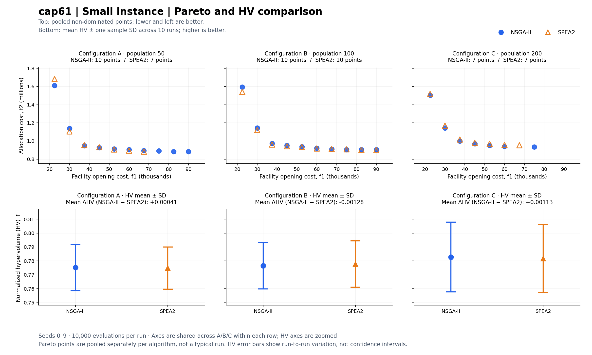
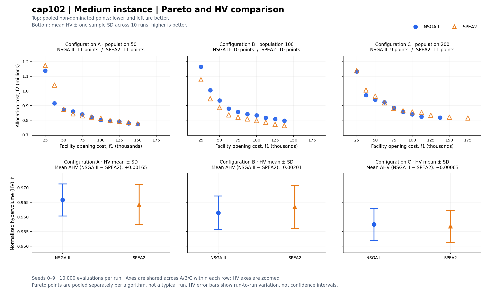
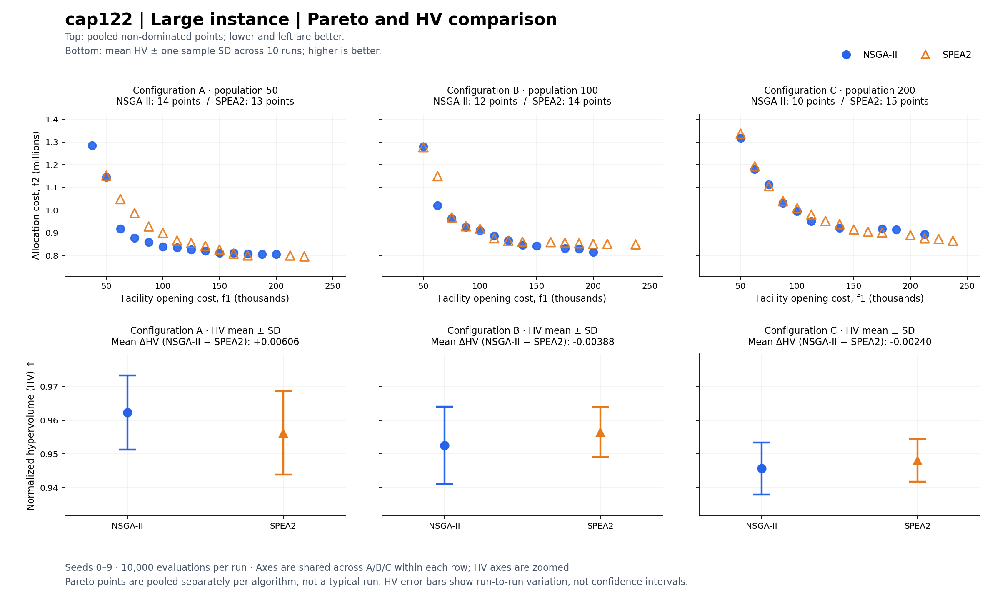

# ACIT4610 Assignment 2: Multi-objective CFLP with MOEAs

NSGA-II and SPEA2 search for facility locations and customer assignments that
minimise **facility opening cost** and **customer allocation cost**, subject to
capacity constraints. Group number: **Group-8**. Group members: **Zhongye Xue,
Syed Mohammad Abdur-Rahman Tirmizey, Jakob Andreas Amtedal, Khoa Anh Huynh**.

Both NSGA-II and SPEA2 are implemented with shared initialization, variation,
capacity repair, and evaluation. The experiment pipeline verifies comparable
protocols, saves results, calculates HV/ND and runtime summaries, performs paired
statistical comparisons, and generates plots. All **360 runs** were completed
locally using the same code, with zero failures. Section 4 presents the results
and 18 statistical comparisons.

## 1. How the next generation is created

Example configuration: `cap61`, population **50**, crossover probability **0.9**
per parent pair, mutation probability **0.02** per gene, seed **0**, and a budget
of **10,000 objective evaluations**, including initialization.

Both algorithms share this preparation and offspring pipeline:

```text
Read cap61: 16 facilities, 50 customers
    -> construct 50 feasible chromosomes (50 facility IDs each)
    -> decode assignments and verify capacity constraints
    -> evaluate opening cost f1 and allocation cost f2 separately

Select parents -> single-point crossover -> per-gene mutation
    -> decode and repair each child -> evaluate feasible children
```

### NSGA-II

```text
Start with the current population
    -> calculate non-dominated ranks and crowding distances
    -> select parents by binary tournaments
    -> generate offspring using the shared pipeline
    -> combine parents and offspring
    -> recalculate ranks and crowding distances
    -> keep complete fronts in rank order
    -> fill remaining places from the next front by largest crowding distance
    -> repeat within the evaluation budget
    -> return non-dominated solutions from the final population
```

Parents can be selected more than once. Parent and offspring populations compete
for survival, so **elitism is part of replacement**. Crowding distance promotes
spread within a front; it is not an additional problem objective.

### SPEA2

```text
Start with the current population and an initially empty archive
    -> combine population and archive
    -> calculate strength, raw fitness, and nearest-neighbour density
    -> update the archive with non-dominated individuals
    -> fill vacancies by fitness, or truncate an oversized archive by distance
    -> select parents from the archive by binary tournaments
    -> generate the next population using the shared pipeline
    -> repeat within the evaluation budget
    -> update the archive with the last evaluated population
    -> return non-dominated solutions from the final archive
```

The external archive preserves elites. Its capacity equals population
size. Archive filling can include dominated individuals, so the final output
must still be filtered for non-dominance.

## 2. Algorithm design

| Block | Design |
| --- | --- |
| Encoding | `a[j]` is the facility serving customer `j`, using zero-based IDs. Each chromosome has one gene per customer; cap61 has 50 genes with values 0–15. Used facilities are open; unused facilities are closed. |
| Initialization | Construct feasible assignments using randomized best fit, with up to 100 attempts per individual. See Initialization below. |
| NSGA-II selection | Binary tournaments prefer lower non-dominated rank, then larger crowding distance. Remaining ties are random. |
| SPEA2 selection | Binary tournaments on archive members prefer lower strength-based fitness plus density; remaining ties are random. |
| Crossover | With probability `pc` per pair, exchange chromosome tails after a random cut. Otherwise copy the parents. Skip crossover for one-gene chromosomes. |
| Mutation | Independently, with probability `pm` per gene, assign that customer to a different randomly selected facility. Skip mutation when only one facility exists. |
| Repair | Relocate customers from overloaded facilities, prioritising a single move that resolves the overload. Details below. |
| Evaluation | Calculate opening and allocation costs separately, only after checking feasibility. |
| Replacement | NSGA-II selects survivors from parents and offspring; SPEA2 replaces the population with offspring while retaining its archive. |
| Termination | Stop at 10,000 objective evaluations, including initial individuals. If less than a full generation remains, evaluate only the remaining number of children. Do not use a fixed generation count across different population sizes. |

Crossover and mutation preserve valid facility IDs and one assignment per
customer, but can violate capacities. Repair returns a separate chromosome and
does not alter benchmark data.

### Objectives and feasibility

For facility `i` and customer `j`, `F[i]` is the opening cost, `C[i][j]` is the
allocation cost, `S[i]` is capacity, and `d[j]` is demand. Let `y[i]` indicate an
open facility and `x[i][j]` indicate an assignment.

```text
Minimise f1 = sum_i F[i] * y[i]
Minimise f2 = sum_i sum_j C[i][j] * x[i][j]

Every customer is assigned exactly once:  sum_i x[i][j] = 1
Assignments use open facilities only:    x[i][j] <= y[i]
Facility capacities are respected:       sum_j d[j] * x[i][j] <= S[i] * y[i]
```

`C[i][j]` already covers the customer's entire demand; do not multiply it by
`d[j]` again. Lower values are preferred for both objectives, which are not
combined into a weighted sum. One solution dominates another if it is no worse
in either objective and strictly better in at least one.

### Selection and archive update

NSGA-II uses non-dominated rank and crowding distance. SPEA2 strength counts
other dominated individuals; raw fitness sums the strengths of all dominators.
Density is `1 / (sigma_k + 2)`, where `k = floor(sqrt(N))`, N is the current
population-plus-archive size, and sigma_k is the kth nearest other individual.
Distances are Euclidean after the fixed instance scaling described in section 4.
Self-distances are excluded; duplicate vectors retain zero distances. A singleton
uses sigma_k = 0. Total fitness is raw fitness plus density; lower is preferred.

Archive filling orders dominated individuals by total fitness, then candidate
index. Oversized non-dominated archives repeatedly remove the candidate with the
lexicographically smallest sorted neighbour-distance vector, recomputing these
vectors after every removal. Exact ties use candidate index. The last evaluated
population is included in the final archive update, even for a partial final
generation. Final output is filtered for non-dominance.

### Initialization

Both algorithms use the same **randomized best-fit construction** in
[`initialization.py`](cflp/initialization.py). Necessary feasibility checks run
first; passing them does not guarantee that construction will succeed. For each
individual:

```text
Start with an unassigned chromosome and each facility's full capacity
    -> order customers by descending demand; break equal-demand ties randomly
    -> for the next customer, retain facilities with enough remaining capacity
    -> shuffle these facilities to randomize ties
    -> sort by remaining capacity after assigning this customer, smallest first
    -> choose uniformly among the best three (or all if fewer than three fit)
    -> assign the customer and subtract its demand from the chosen facility
    -> repeat for every customer, then verify the complete assignment
```

Placing larger demands first aims to avoid leaving difficult customers until
capacity is fragmented. Best fit favours tighter packing; choosing among three
candidates introduces variation between individuals. This construction uses
capacity and demand, without scoring opening or allocation costs. It does not
sample feasible solutions uniformly; shuffling facility ties avoids favouring
low facility IDs.

If no facility can accommodate a customer, discard the partial assignment and
restart that individual with fresh randomized choices. Allow at most **100
construction attempts per individual**, including the first attempt; exhaustion
raises an error and fails the run. Initial individuals are constructed feasibly
without calling the relocation repair used after crossover and mutation.

Repeat until the population contains **50, 100, or 200 individuals**, depending
on configuration A, B, or C. Duplicate individuals are allowed. Each optimizer
uses its own `Random(seed)` generator; the same instance, configuration and seed
produce the same ordered initial population for both algorithms, verified by its
saved fingerprint. Each initial individual is then evaluated once, counting
toward the **10,000-evaluation budget**. Failed construction attempts receive no
objective evaluation, but their processing time is included in runtime.

### Decoding and capacity repair

Decoding groups customers by their facility genes, identifies open facilities,
and sums assigned demands. Repair then applies:

```text
Choose the facility with the largest overload E
    -> find customers with at least one feasible destination
    -> if any has demand >= E, choose the smallest such demand
    -> otherwise choose the largest movable demand
    -> move to the destination with least remaining capacity after assignment
    -> update loads and repeat until no facility is overloaded
```

Unused facilities are eligible destinations. All ties use the lowest relevant
ID. The rule aims to limit gene changes, without guaranteeing a global minimum.
Destinations remain feasible, so each moved customer is relocated at most once.
Invalid encodings or a lack of feasible moves raise `ValueError`. The shared
`offspring.py` pipeline then retries crossover and mutation for the same parent
pair. Each pair visit allows up to 50 variation attempts, each with up to two
candidates; it moves to the next pair once at least one child succeeds. Exhaustion
fails the run explicitly. Failed candidates receive no objective evaluation,
but their processing time is included in runtime.

### Repair example: cap61

The candidate chromosome before repair is:

```text
[2, 3, 3, 2, 3, 3, 2, 2, 3, 3,
 0, 3, 1, 3, 3, 3, 3, 2, 3, 3,
 0, 3, 3, 3, 3, 3, 1, 3, 3, 3,
 3, 3, 3, 0, 3, 0, 1, 2, 3, 3,
 0, 2, 3, 3, 2, 3, 3, 3, 2, 3]
```

Facility 0 carries **20,492**, exceeding its **15,000** capacity by **5,492**.
Customer 10 has demand **5,495**, and facility 1 has exactly **5,495** spare
capacity. Repair changes only `a[10]` from **0 to 1**.

| Facility | Open after repair | Customers after repair | Load before → after | Capacity |
| --- | ---: | --- | ---: | ---: |
| 0 | 1 | 20, 33, 35, 40 | 20,492 → 14,997 | 15,000 |
| 1 | 1 | 10, 12, 26, 36 | 9,505 → 15,000 | 15,000 |
| 2 | 1 | 0, 3, 6, 7, 17, 37, 41, 44, 48 | 14,993 → 14,993 | 15,000 |
| 3 | 1 | 1, 2, 4, 5, 8, 9, 11, 13, 14, 15, 16, 18, 19, 21, 22, 23, 24, 25, 27, 28, 29, 30, 31, 32, 34, 38, 39, 42, 43, 45, 46, 47, 49 | 13,278 → 13,278 | 15,000 |
| 4–15 | All 0 | None | All 0 | 15,000 each |

Every customer appears exactly once, and no facility exceeds capacity. Using the
original costs, **f1 = 4 × 7,500 = 30,000** and **f2 = 1,864,204.2125**.
This is a worked feasibility example, not a benchmark result or an optimality claim.

## 3. Instances and experiment parameters

| Category | Instances | Facilities × customers | Detailed comparison |
| --- | --- | --- | --- |
| Small | cap61, cap62 | 16 × 50 | cap61 |
| Medium | cap101, cap102 | 25 × 50 | cap101 |
| Large | cap121, cap122 | 50 × 50 | cap121 |

The original [OR-Library](https://people.brunel.ac.uk/~mastjjb/jeb/orlib/capinfo.html)
files are bundled in `data/or_library`; see [data details](data/README.md).
Costs, capacities, and demands remain unchanged. All six instances are included
in experiments; the three focus instances are selected for detailed discussion.

| Configuration | Parameter set | Population | Evaluation budget | Crossover per pair | Mutation per gene |
| --- | --- | ---: | ---: | ---: | ---: |
| A | smaller_population | 50 | 10,000 | 0.9 | 0.02 |
| B | reference | 100 | 10,000 | 0.9 | 0.02 |
| C | larger_population | 200 | 10,000 | 0.9 | 0.02 |

[configs/experiments.json](configs/experiments.json) contains the executable common settings.
Both algorithms use seeds **0–9**, giving **2 algorithms × 6 instances × 3
configurations × 10 independent runs = 360 runs**. SPEA2 archive capacities are
**50, 100, and 200**, respectively.

Each evaluation produces both objective values and counts once against the
budget, including initialization. Repeated candidate assignments still consume
evaluations; only stored parent objectives are reused during selection. Both
algorithms stop at the exact budget. Population size varies while crossover,
mutation, and evaluation budget remain fixed. For SPEA2, archive size changes with population size, so
those two effects cannot be separated by this design.

The full experiment uses **3,600,000 objective evaluations**. Configurations
A, B, and C perform 199, 99, and 49 full generations after initialization,
respectively. These are starting settings, not claims of optimal tuning.

Runs execute sequentially, with algorithm order reversed on alternate seeds
within each instance/configuration. Timing covers initialization through final-front
extraction, including retries; it excludes data loading, post-run verification,
metrics, and file writing. Each record includes the Python/platform/machine
environment, Git revision, Python-source fingerprint, and input-data hash. The
source fingerprint also identifies uncommitted Python changes. Use the same
computational environment and shared procedures for comparison. SHA-256 hashes
of the actual ordered initial populations verify that the two algorithms share
the same starting population for each seed. Their subsequent trajectories are
allowed to diverge. Runs with different common settings, budgets, source/data
hashes, normalization, or environments are rejected before comparisons or plots.
Archive settings remain algorithm-specific; they must be consistent within SPEA2.

## 4. Results and evaluation

**NSGA-II: 180 completed runs; SPEA2: 180 completed runs; zero failures.**
Each row summarizes 10 independent runs with 10,000 evaluations each. All 36
rows use the same source fingerprint, declared common parameters, timing scope,
and per-instance normalization. Runtime values describe this local execution
and may differ on another machine.

This repository includes the result tables below and six PNG figures in
`docs/figures/`. Raw run records, CSV summaries, and additional plot exports are
generated locally using the commands in section 5 and are not tracked in Git.

- **Quality:** compare hypervolume (HV); higher is better. Report mean, sample
  standard deviation (`n-1`), best, and worst across independent runs.
- **Comparability:** use common normalization bounds and one fixed HV reference
  point per instance across both algorithms and all configurations. Implemented
  scaling uses `U1 = sum_i F[i]`, `U2 = sum_j max_i C[i][j]`, and `fk / Uk`
  (scale 1 for a zero bound). Feasible normalized costs lie in `[0, 1]`, so the
  fixed reference `(1.1, 1.1)` is strictly worse. These conservative bounds are
  independent of observed results and apply to both algorithms. Compare HV within
  an instance; values across different instances are not a universal ranking.
- **Diversity:** report the number of distinct non-dominated objective vectors
  (ND). Duplicate objective vectors count once; a larger ND alone does not prove
  better solution quality.
- **Efficiency:** compare mean runtime alongside solution quality using the
  timing scope above and the environment recorded in each run JSON.

Instance: **cap61**

| Config | MOEA | HV mean | HV SD | HV best | HV worst | ND mean | Time mean (s) |
| --- | --- | ---: | ---: | ---: | ---: | ---: | ---: |
| A | NSGA-II | 0.775261 | 0.016580 | 0.821206 | 0.762912 | 8.5 | 1.666 |
| A | SPEA2 | 0.774851 | 0.015126 | 0.815370 | 0.762776 | 7.8 | 2.379 |
| B | NSGA-II | 0.776536 | 0.016697 | 0.816141 | 0.763091 | 8.6 | 2.299 |
| B | SPEA2 | 0.777820 | 0.016645 | 0.818325 | 0.767318 | 8.3 | 3.732 |
| C | NSGA-II | 0.782784 | 0.025129 | 0.822418 | 0.753788 | 7.4 | 3.612 |
| C | SPEA2 | 0.781649 | 0.024424 | 0.820631 | 0.760927 | 7.3 | 6.626 |

Instance: **cap62**

| Config | MOEA | HV mean | HV SD | HV best | HV worst | ND mean | Time mean (s) |
| --- | --- | ---: | ---: | ---: | ---: | ---: | ---: |
| A | NSGA-II | 0.775261 | 0.016580 | 0.821206 | 0.762912 | 8.5 | 1.697 |
| A | SPEA2 | 0.774851 | 0.015126 | 0.815370 | 0.762776 | 7.8 | 2.401 |
| B | NSGA-II | 0.776536 | 0.016697 | 0.816141 | 0.763091 | 8.6 | 2.281 |
| B | SPEA2 | 0.777820 | 0.016645 | 0.818325 | 0.767318 | 8.3 | 3.720 |
| C | NSGA-II | 0.782784 | 0.025129 | 0.822418 | 0.753788 | 7.4 | 3.636 |
| C | SPEA2 | 0.781649 | 0.024424 | 0.820631 | 0.760927 | 7.3 | 6.650 |

Instance: **cap101**

| Config | MOEA | HV mean | HV SD | HV best | HV worst | ND mean | Time mean (s) |
| --- | --- | ---: | ---: | ---: | ---: | ---: | ---: |
| A | NSGA-II | 0.965845 | 0.005484 | 0.972833 | 0.955371 | 10.4 | 1.585 |
| A | SPEA2 | 0.964199 | 0.006835 | 0.973436 | 0.948085 | 10.3 | 2.387 |
| B | NSGA-II | 0.961454 | 0.005763 | 0.968828 | 0.950686 | 10.2 | 2.238 |
| B | SPEA2 | 0.963461 | 0.007326 | 0.977355 | 0.953688 | 11.0 | 3.689 |
| C | NSGA-II | 0.957435 | 0.005495 | 0.965711 | 0.949963 | 9.8 | 3.538 |
| C | SPEA2 | 0.956802 | 0.005491 | 0.964884 | 0.946105 | 10.0 | 6.554 |

Instance: **cap102**

| Config | MOEA | HV mean | HV SD | HV best | HV worst | ND mean | Time mean (s) |
| --- | --- | ---: | ---: | ---: | ---: | ---: | ---: |
| A | NSGA-II | 0.965845 | 0.005484 | 0.972833 | 0.955371 | 10.4 | 1.592 |
| A | SPEA2 | 0.964199 | 0.006835 | 0.973436 | 0.948085 | 10.3 | 2.382 |
| B | NSGA-II | 0.961454 | 0.005763 | 0.968828 | 0.950686 | 10.2 | 2.235 |
| B | SPEA2 | 0.963461 | 0.007326 | 0.977355 | 0.953688 | 11.0 | 3.684 |
| C | NSGA-II | 0.957435 | 0.005495 | 0.965711 | 0.949963 | 9.8 | 3.523 |
| C | SPEA2 | 0.956802 | 0.005491 | 0.964884 | 0.946105 | 10.0 | 6.557 |

Instance: **cap121**

| Config | MOEA | HV mean | HV SD | HV best | HV worst | ND mean | Time mean (s) |
| --- | --- | ---: | ---: | ---: | ---: | ---: | ---: |
| A | NSGA-II | 0.962313 | 0.011004 | 0.985153 | 0.951886 | 12.3 | 1.763 |
| A | SPEA2 | 0.956253 | 0.012414 | 0.973610 | 0.930749 | 10.9 | 2.587 |
| B | NSGA-II | 0.952570 | 0.011513 | 0.970840 | 0.929307 | 11.1 | 2.376 |
| B | SPEA2 | 0.956452 | 0.007395 | 0.965457 | 0.944614 | 12.1 | 3.842 |
| C | NSGA-II | 0.945693 | 0.007749 | 0.953045 | 0.930382 | 10.3 | 3.774 |
| C | SPEA2 | 0.948093 | 0.006323 | 0.958699 | 0.934909 | 11.1 | 6.772 |

Instance: **cap122**

| Config | MOEA | HV mean | HV SD | HV best | HV worst | ND mean | Time mean (s) |
| --- | --- | ---: | ---: | ---: | ---: | ---: | ---: |
| A | NSGA-II | 0.962313 | 0.011004 | 0.985153 | 0.951886 | 12.3 | 1.774 |
| A | SPEA2 | 0.956253 | 0.012414 | 0.973610 | 0.930749 | 10.9 | 2.577 |
| B | NSGA-II | 0.952570 | 0.011513 | 0.970840 | 0.929307 | 11.1 | 2.384 |
| B | SPEA2 | 0.956452 | 0.007395 | 0.965457 | 0.944614 | 12.1 | 3.856 |
| C | NSGA-II | 0.945693 | 0.007749 | 0.953045 | 0.930382 | 10.3 | 3.740 |
| C | SPEA2 | 0.948093 | 0.006323 | 0.958699 | 0.934909 | 11.1 | 6.729 |

The figures below cover **all six instances**, with one figure per instance.
The top row shows Pareto points; the bottom row shows HV mean ± SD for the
same configurations. Columns represent A, B, and C. Axis ranges are shared across configurations within each metric
row; Pareto and HV axes are separate.

**Pareto comparison:** the horizontal axis is facility opening cost (`f1`), and
the vertical axis is customer allocation cost (`f2`); lower and left are better.
For each algorithm separately, combine the final objective vectors from seeds
0–9, remove duplicates, and retain its non-dominated points. Blue circles denote
NSGA-II; orange hollow triangles denote SPEA2, keeping overlapping points visible.
No lines connect these points. This pooled set represents combined search coverage
across 10 runs, not a typical run, and is not used to calculate per-run HV.

**HV comparison:** markers show mean HV across the 10 independent runs; error
bars extend to the mean **± one sample standard deviation** (`n-1`). Higher mean
HV indicates better average performance; a shorter error bar indicates less
variation between runs. These bars are neither confidence intervals nor minimum/
maximum ranges. Their overlap does not determine statistical significance; use
the paired tests reported below. The y-axes are zoomed to show variation.

**Small instance: cap61 — configurations A, B, and C**



**Small instance: cap62 — configurations A, B, and C**


**Medium instance: cap101 — configurations A, B, and C**


**Medium instance: cap102 — configurations A, B, and C**



**Large instance: cap121 — configurations A, B, and C**


**Large instance: cap122 — configurations A, B, and C**



**Statistical comparison:** the primary endpoint is HV. For each of the 18
instance/configuration groups, use an exact two-sided paired permutation test
on the mean HV difference (NSGA-II minus SPEA2). Pair runs by seed only after
verifying identical initial populations. Enumerate all `2^10 = 1024` within-pair
label swaps. The null assumes exchangeable algorithm labels within independent
initialization pairs (symmetric paired differences). Sharing initial populations
supports this design; it does not guarantee the null assumption is true.

Use alpha 0.05 and Holm correction across all 18 comparisons, fixed before
examining results. Report raw/adjusted p-values, mean HV difference, and paired
NSGA-II win fraction (ties count as half). ND and runtime remain descriptive.

No p-values are published until all declared groups have the exact seed set,
at least 10 pairs, matching protocols, and no failed runs. The focus-instance
subset does not get a smaller correction family after seeing the results.
The exact test uses the paired-label-swap construction described in the
[SciPy permutation-test documentation](https://docs.scipy.org/doc/scipy/reference/generated/scipy.stats.permutation_test.html);
our implementation uses only the standard library.

**Statistical comparison results (HV):** positive differences favour NSGA-II;
negative differences favour SPEA2. Win fraction is for NSGA-II within paired
initializations, with ties counted as half. Holm-adjusted p-values cover the
entire 18-comparison family. Failure to reject does not demonstrate equivalence.

| Instance | Config | Mean HV difference | NSGA-II paired win fraction | Raw p | Holm p | Reject at 0.05 |
| --- | --- | ---: | ---: | ---: | ---: | --- |
| cap61 | A | +0.000411 | 0.40 | 0.730469 | 1.000000 | No |
| cap61 | B | -0.001284 | 0.20 | 0.160156 | 1.000000 | No |
| cap61 | C | +0.001135 | 0.80 | 0.316406 | 1.000000 | No |
| cap62 | A | +0.000411 | 0.40 | 0.730469 | 1.000000 | No |
| cap62 | B | -0.001284 | 0.20 | 0.160156 | 1.000000 | No |
| cap62 | C | +0.001135 | 0.80 | 0.316406 | 1.000000 | No |
| cap101 | A | +0.001646 | 0.60 | 0.294922 | 1.000000 | No |
| cap101 | B | -0.002006 | 0.30 | 0.322266 | 1.000000 | No |
| cap101 | C | +0.000634 | 0.60 | 0.703125 | 1.000000 | No |
| cap102 | A | +0.001646 | 0.60 | 0.294922 | 1.000000 | No |
| cap102 | B | -0.002006 | 0.30 | 0.322266 | 1.000000 | No |
| cap102 | C | +0.000634 | 0.60 | 0.703125 | 1.000000 | No |
| cap121 | A | +0.006060 | 0.60 | 0.054688 | 0.984375 | No |
| cap121 | B | -0.003882 | 0.40 | 0.167969 | 1.000000 | No |
| cap121 | C | -0.002400 | 0.30 | 0.253906 | 1.000000 | No |
| cap122 | A | +0.006060 | 0.60 | 0.054688 | 0.984375 | No |
| cap122 | B | -0.003882 | 0.40 | 0.167969 | 1.000000 | No |
| cap122 | C | -0.002400 | 0.30 | 0.253906 | 1.000000 | No |

**Discussion and conclusions:** the tables, pooled Pareto points, and HV error bars expose
quality, diversity, runtime and configuration effects without selecting only the
best seed. The comparison concerns the implemented algorithms under this budget
and initialization heuristic; it is not an optimality claim. ND alone does not
measure quality, and different population sizes trade more generations for
larger populations. For SPEA2, population size also changes archive capacity.

## 5. Reproduce the project

Use Python **3.10 or newer**. The algorithms, metrics, SVG plots, and tests use
only the standard library; no third-party installation is required for that
pipeline. Figure exports use Matplotlib. Run the following commands from the
repository root. On a fresh clone, complete the batch before running the
summary and figure commands; these read the locally saved run records.

```bash
python3 -m unittest discover -s tests -v
python3 -m cflp --verify-data
python3 -m cflp --plan

# One complete NSGA-II run
python3 -m cflp --run --algorithm nsga2 --instance cap61 --configuration reference --seed 0 --output results/example

# All 360 runs, with paired seeds and alternating algorithm order
python3 -m cflp --batch --algorithm both --output results/comparison --resume

# Rebuild tables and plots from saved runs
python3 -m cflp --summarize --output results/comparison

# Reproduce all six README figures (Pareto points and HV mean ± SD)
python3 -m pip install -r requirements-plotting.txt
python3 scripts/plot_comparison.py --results results/comparison --output docs/figures

# Optional: inspect individual-seed fronts for the three focus instances
python3 -m cflp --plot --output results/comparison
```

Validation includes **74 passing tests**, unchanged benchmark checksums,
exact evaluation-budget checks, verified initialization pairing, protocol-mismatch
rejection, hand-calculated statistical tests, and end-to-end run/plot commands.

- `--run` selects one configuration and seed; defaults are cap61, `reference`,
  seed 0, and NSGA-II. `--batch` uses all configurations and seeds 0–9; add
  `--instance cap61` to restrict it to 30 runs per algorithm. Use `--algorithm both`
  with `--batch` for all 360 runs (60 for one instance), or `--algorithm spea2` for
  SPEA2 alone. The default output directory is `results/comparison`. Configuration
  and seed flags apply to single runs only.
- `--plot` exports the three focus-instance figures from saved records under
  `--output`, writing PNG/PDF/SVG into its `figures/` directory. Add
  `--instance cap61` to export one instance. It does not rerun the optimizer.
- `--budget 500` is available for learning or pilot runs. Use a separate output
  directory so pilot results are not mixed with the 10,000-evaluation experiment.
- `--resume` reuses completed records only when parameters, seed, source hash,
  data hash, and recorded environment match. Existing unmatched or failed
  records cause an error; retain them and use a different output directory for
  corrected runs. Existing records are never silently overwritten.
- Failed runs save an error and stop the batch. A partial batch is not a completed
  experiment. `--summarize` can summarize completed records and reports failures
  separately in `summary_status.json`.
- `--plan` previews the 360-run design without executing it. Both algorithms
  are registered. `--summarize` also writes `comparison.csv` and
  `comparison_status.json`; partial experiments produce no inferential rows.

The commands generate `runs/<instance>__<algorithm>__<configuration>__seed<n>.json`,
`summary.csv`, `summary_status.json`, `comparison.csv`, `comparison_status.json`, and
`plots/<instance>__<configuration>.svg` beneath the selected output directory.
The comparison script exports each `<instance>_comparison` figure in PNG, PDF,
and SVG. Only the six PNG snapshots are included in the repository.

The main components are `representation.py` (encoding), `evaluation.py`
(objectives), `operators.py` (variation), `repair.py` (capacity repair), and
`nsga2.py` / `spea2.py` (algorithm logic), under `cflp/`. Shared initialization is
in `initialization.py`; the shared child pipeline is in `offspring.py`. The
runner, metrics, summaries, and plots are in `experiments.py`, `metrics.py`,
`statistics.py`, and `plotting.py`.

Both registered algorithms implement `run(instance, config, seed)` with this
shared result contract (shown for SPEA2):

```python
{
    "algorithm": "spea2",
    "status": "completed",
    "seed": seed,
    "evaluations": actual_evaluations,
    "generations": generations,
    "initial_population_sha256": initial_population_fingerprint,
    "population": final_nondominated_assignments,
    "objectives": corresponding_objective_pairs,
}
```

Both algorithms are registered in `experiments.ALGORITHMS` and use the shared
initialization and offspring pipeline described in section 2. `protocol.py`
validates comparable run records before aggregation or plotting.

Use a new output directory after any Python-source change, or resume only an
identical source/data/environment run. Do not edit stored fingerprints to bypass
this check. Keep results from different experiment protocols in separate
directories.
