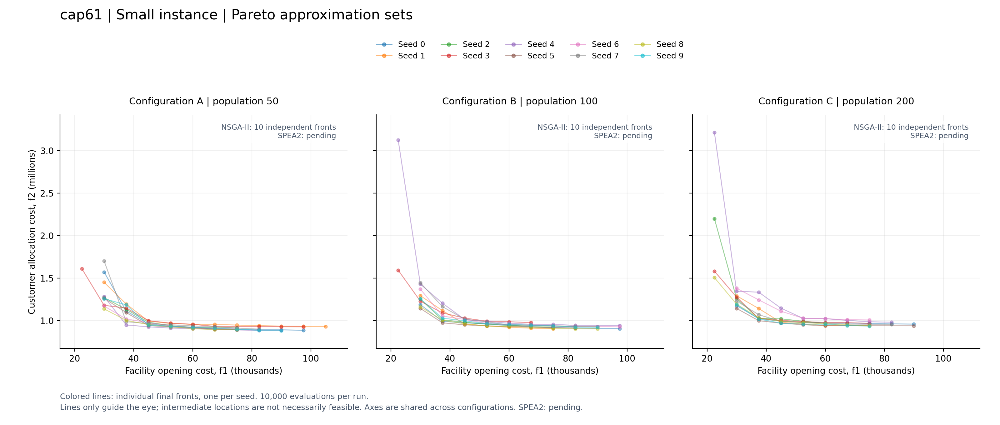
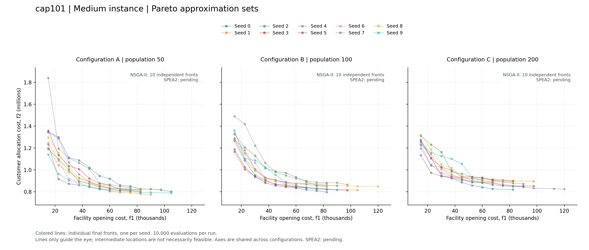
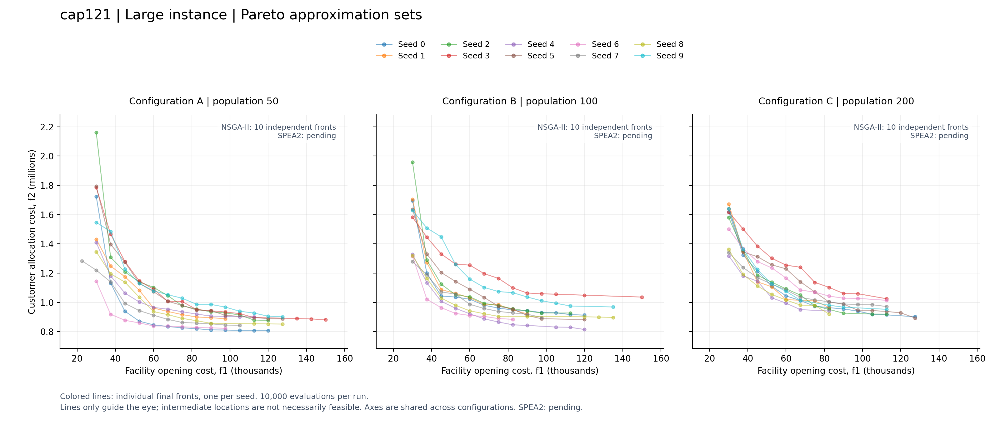

# ACIT4610 Assignment 2: Multi-objective CFLP with MOEAs

NSGA-II and SPEA2 search for facility locations and customer assignments that
minimise **facility opening cost** and **customer allocation cost**, subject to
capacity constraints. Group number: **Group-8**. Group members: **Zhongye Xue,
Syed Mohammad Abdur-Rahman Tirmizey, Jakob Andreas Amtedal, Khoa Anh Huynh**.

The sections below describe the implemented NSGA-II pipeline and planned SPEA2
design. Shared initialization, variation, capacity repair, evaluation, complete
NSGA-II evolution, hypervolume, result saving, summaries, and plotting are
implemented. **All 180 NSGA-II runs are complete locally**. SPEA2 and the
two-algorithm statistical comparison remain pending.

## 1. How the next generation is created

Example configuration: `cap61`, population **50**, crossover probability **0.9**
per parent pair, mutation probability **0.02** per gene, seed **0**, and a budget
of **10,000 objective evaluations**, including initialization.

Both algorithms share this preparation and offspring pipeline:

```text
Read cap61: 16 facilities, 50 customers
    -> construct 50 feasible chromosomes (50 facility IDs each)
    -> decode assignments and verify capacity constraints
    -> evaluate opening cost f1 and allocation cost f2 separately

Select parents -> single-point crossover -> per-gene mutation
    -> decode and repair each child -> evaluate feasible children
```

### NSGA-II

```text
Start with the current population
    -> calculate non-dominated ranks and crowding distances
    -> select parents by binary tournaments
    -> generate offspring using the shared pipeline
    -> combine parents and offspring
    -> recalculate ranks and crowding distances
    -> keep complete fronts in rank order
    -> fill remaining places from the next front by largest crowding distance
    -> repeat within the evaluation budget
    -> return non-dominated solutions from the final population
```

Parents can be selected more than once. Parent and offspring populations compete
for survival, so **elitism is part of replacement**. Crowding distance promotes
spread within a front; it is not an additional problem objective.

### SPEA2

```text
Start with the current population and an initially empty archive
    -> combine population and archive
    -> calculate strength, raw fitness, and nearest-neighbour density
    -> update the archive with non-dominated individuals
    -> fill vacancies by fitness, or truncate an oversized archive by distance
    -> select parents from the archive by binary tournaments
    -> generate the next population using the shared pipeline
    -> repeat within the evaluation budget
    -> update the archive with the last evaluated population
    -> return non-dominated solutions from the final archive
```

SPEA2 is not implemented yet; the flow above is its intended design.
The external archive preserves elites. Its proposed capacity equals population
size. Archive filling can include dominated individuals, so the final output
must still be filtered for non-dominance.

## 2. Algorithm design

| Block | Design |
| --- | --- |
| Encoding | `a[j]` is the facility serving customer `j`, using zero-based IDs. Each chromosome has one gene per customer; cap61 has 50 genes with values 0–15. Used facilities are open; unused facilities are closed. |
| Initialization | Process customers by descending demand, randomly breaking demand ties. Shuffle feasible facilities before stable best-fit sorting, then randomly choose among the best three. Verify each individual and allow at most 100 construction attempts per individual. Use one seeded random-number generator per run. |
| NSGA-II selection | Binary tournaments prefer lower non-dominated rank, then larger crowding distance. Remaining ties are random. |
| SPEA2 selection | Planned: binary tournaments on archive members prefer lower strength-based fitness plus density; remaining ties are random. |
| Crossover | With probability `pc` per pair, exchange chromosome tails after a random cut. Otherwise copy the parents. Skip crossover for one-gene chromosomes. |
| Mutation | Independently, with probability `pm` per gene, assign that customer to a different randomly selected facility. Skip mutation when only one facility exists. |
| Repair | Relocate customers from overloaded facilities, prioritising a single move that resolves the overload. Details below. |
| Evaluation | Calculate opening and allocation costs separately, only after checking feasibility. |
| Replacement | NSGA-II selects survivors from parents and offspring; SPEA2 replaces the population with offspring while retaining its archive. |
| Termination | Stop at 10,000 objective evaluations, including initial individuals. If less than a full generation remains, evaluate only the remaining number of children. Do not use a fixed generation count across different population sizes. |

Crossover and mutation preserve valid facility IDs and one assignment per
customer, but can violate capacities. Repair returns a separate chromosome and
does not alter benchmark data. Initialization randomizes equal-capacity facility ties to avoid favouring low
facility IDs. Its best-fit construction is a heuristic, not uniform sampling of
feasible solutions. Necessary feasibility checks precede construction, but passing
them does not prove that a feasible assignment exists.

### Objectives and feasibility

For facility `i` and customer `j`, `F[i]` is the opening cost, `C[i][j]` is the
allocation cost, `S[i]` is capacity, and `d[j]` is demand. Let `y[i]` indicate an
open facility and `x[i][j]` indicate an assignment.

```text
Minimise f1 = sum_i F[i] * y[i]
Minimise f2 = sum_i sum_j C[i][j] * x[i][j]

Every customer is assigned exactly once:  sum_i x[i][j] = 1
Assignments use open facilities only:    x[i][j] <= y[i]
Facility capacities are respected:       sum_j d[j] * x[i][j] <= S[i] * y[i]
```

`C[i][j]` already covers the customer's entire demand; do not multiply it by
`d[j]` again. Lower values are preferred for both objectives, which are not
combined into a weighted sum. One solution dominates another if it is no worse
in either objective and strictly better in at least one.

NSGA-II uses non-dominated rank and crowding distance. In the planned SPEA2 design,
strength counts dominated individuals, raw fitness sums dominators' strengths,
and density penalises crowded regions. The density neighbour index and distance
scaling remain to be fixed before experiments.

### Decoding and capacity repair

Decoding groups customers by their facility genes, identifies open facilities,
and sums assigned demands. Repair then applies:

```text
Choose the facility with the largest overload E
    -> find customers with at least one feasible destination
    -> if any has demand >= E, choose the smallest such demand
    -> otherwise choose the largest movable demand
    -> move to the destination with least remaining capacity after assignment
    -> update loads and repeat until no facility is overloaded
```

Unused facilities are eligible destinations. All ties use the lowest relevant
ID. The rule aims to limit gene changes, without guaranteeing a global minimum.
Destinations remain feasible, so each moved customer is relocated at most once.
Invalid encodings or a lack of feasible moves raise `ValueError`. The shared
`offspring.py` pipeline then retries crossover and mutation for the same parent
pair. Each pair visit allows up to 50 variation attempts, each with up to two
candidates; it moves to the next pair once at least one child succeeds. Exhaustion
fails the run explicitly. This retries variation, rather than constructing an
independent replacement or silently copying a parent. Failed candidates receive
no objective evaluation, but their processing time is included in runtime.

### Example: cap61

The initial chromosome is:

```text
[2, 3, 3, 2, 3, 3, 2, 2, 3, 3,
 0, 3, 1, 3, 3, 3, 3, 2, 3, 3,
 0, 3, 3, 3, 3, 3, 1, 3, 3, 3,
 3, 3, 3, 0, 3, 0, 1, 2, 3, 3,
 0, 2, 3, 3, 2, 3, 3, 3, 2, 3]
```

Facility 0 carries **20,492**, exceeding its **15,000** capacity by **5,492**.
Customer 10 has demand **5,495**, and facility 1 has exactly **5,495** spare
capacity. Repair changes only `a[10]` from **0 to 1**.

| Facility | Open after repair | Customers after repair | Load before → after | Capacity |
| --- | ---: | --- | ---: | ---: |
| 0 | 1 | 20, 33, 35, 40 | 20,492 → 14,997 | 15,000 |
| 1 | 1 | 10, 12, 26, 36 | 9,505 → 15,000 | 15,000 |
| 2 | 1 | 0, 3, 6, 7, 17, 37, 41, 44, 48 | 14,993 → 14,993 | 15,000 |
| 3 | 1 | 1, 2, 4, 5, 8, 9, 11, 13, 14, 15, 16, 18, 19, 21, 22, 23, 24, 25, 27, 28, 29, 30, 31, 32, 34, 38, 39, 42, 43, 45, 46, 47, 49 | 13,278 → 13,278 | 15,000 |
| 4–15 | All 0 | None | All 0 | 15,000 each |

Every customer appears exactly once, and no facility exceeds capacity. Using the
original costs, **f1 = 4 × 7,500 = 30,000** and **f2 = 1,864,204.2125**.
This is a worked feasibility example, not a benchmark result or an optimality claim.

## 3. Instances and experiment parameters

| Category | Instances | Facilities × customers | Detailed comparison |
| --- | --- | --- | --- |
| Small | cap61, cap62 | 16 × 50 | cap61 |
| Medium | cap101, cap102 | 25 × 50 | cap101 |
| Large | cap121, cap122 | 50 × 50 | cap121 |

The original [OR-Library](https://people.brunel.ac.uk/~mastjjb/jeb/orlib/capinfo.html)
files are bundled in `data/or_library`; see [data details](data/README.md).
Costs, capacities, and demands remain unchanged. All six instances are included
in experiments; the three focus instances are selected for detailed discussion.

| Configuration | Parameter set | Population | Evaluation budget | Crossover per pair | Mutation per gene |
| --- | --- | ---: | ---: | ---: | ---: |
| A | smaller_population | 50 | 10,000 | 0.9 | 0.02 |
| B | reference | 100 | 10,000 | 0.9 | 0.02 |
| C | larger_population | 200 | 10,000 | 0.9 | 0.02 |

[configs/experiments.json](configs/experiments.json) contains the executable common settings.
Both algorithms use seeds **0–9**, giving **2 algorithms × 6 instances × 3
configurations × 10 independent runs = 360 runs**. SPEA2 archive capacities are
provisionally **50, 100, and 200**, respectively.

Each evaluation produces both objective values and counts once against the
budget, including initialization; caching by assignment is disabled. Repeated candidate
assignments still consume evaluations, while stored parent objectives are reused
during selection. NSGA-II handles the remaining budget without overshooting;
SPEA2 must follow the same rule. Population size varies while crossover, mutation, and evaluation
budget remain fixed. For SPEA2, archive size changes with population size, so
those two effects cannot be separated by this design.

The NSGA-II experiment runner is executable. Its 180 runs cover all six instances,
three configurations, and seeds 0–9, with 1,800,000 objective evaluations in total.
The configurations perform 199, 99, and 49 full evolution generations after
initialization, respectively. These are starting settings, not claims of optimal
tuning.

Runs execute sequentially. Timing covers initialization through final-front
extraction, including retries; it excludes data loading, post-run verification,
metrics, and file writing. Each record includes the Python/platform/machine
environment, Git revision, Python-source fingerprint, and input-data hash. The
source fingerprint also identifies uncommitted Python changes. Use the same
computational environment and shared procedures for the eventual comparison.

## 4. Results and evaluation

**NSGA-II: 180 completed runs, zero failures; SPEA2: pending.** Each populated
row below summarizes 10 independent runs with 10,000 evaluations each. Dashes
mean pending results, not zero values. Across the six tables, 18 NSGA-II rows
are populated and 18 SPEA2 rows await implementation. Runtime values describe
this local execution and may differ on another machine.

Instance: **cap61**

| Config | MOEA | HV mean | HV SD | HV best | HV worst | ND mean | Time mean (s) |
| --- | --- | ---: | ---: | ---: | ---: | ---: | ---: |
| A | NSGA-II | 0.775261 | 0.016580 | 0.821206 | 0.762912 | 8.5 | 1.631 |
| A | SPEA2 | — | — | — | — | — | — |
| B | NSGA-II | 0.776536 | 0.016697 | 0.816141 | 0.763091 | 8.6 | 2.275 |
| B | SPEA2 | — | — | — | — | — | — |
| C | NSGA-II | 0.782784 | 0.025129 | 0.822418 | 0.753788 | 7.4 | 3.552 |
| C | SPEA2 | — | — | — | — | — | — |

Instance: **cap62**

| Config | MOEA | HV mean | HV SD | HV best | HV worst | ND mean | Time mean (s) |
| --- | --- | ---: | ---: | ---: | ---: | ---: | ---: |
| A | NSGA-II | 0.775261 | 0.016580 | 0.821206 | 0.762912 | 8.5 | 1.628 |
| A | SPEA2 | — | — | — | — | — | — |
| B | NSGA-II | 0.776536 | 0.016697 | 0.816141 | 0.763091 | 8.6 | 2.232 |
| B | SPEA2 | — | — | — | — | — | — |
| C | NSGA-II | 0.782784 | 0.025129 | 0.822418 | 0.753788 | 7.4 | 3.567 |
| C | SPEA2 | — | — | — | — | — | — |

Instance: **cap101**

| Config | MOEA | HV mean | HV SD | HV best | HV worst | ND mean | Time mean (s) |
| --- | --- | ---: | ---: | ---: | ---: | ---: | ---: |
| A | NSGA-II | 0.965845 | 0.005484 | 0.972833 | 0.955371 | 10.4 | 1.625 |
| A | SPEA2 | — | — | — | — | — | — |
| B | NSGA-II | 0.961454 | 0.005763 | 0.968828 | 0.950686 | 10.2 | 2.157 |
| B | SPEA2 | — | — | — | — | — | — |
| C | NSGA-II | 0.957435 | 0.005495 | 0.965711 | 0.949963 | 9.8 | 3.409 |
| C | SPEA2 | — | — | — | — | — | — |

Instance: **cap102**

| Config | MOEA | HV mean | HV SD | HV best | HV worst | ND mean | Time mean (s) |
| --- | --- | ---: | ---: | ---: | ---: | ---: | ---: |
| A | NSGA-II | 0.965845 | 0.005484 | 0.972833 | 0.955371 | 10.4 | 1.534 |
| A | SPEA2 | — | — | — | — | — | — |
| B | NSGA-II | 0.961454 | 0.005763 | 0.968828 | 0.950686 | 10.2 | 2.201 |
| B | SPEA2 | — | — | — | — | — | — |
| C | NSGA-II | 0.957435 | 0.005495 | 0.965711 | 0.949963 | 9.8 | 3.445 |
| C | SPEA2 | — | — | — | — | — | — |

Instance: **cap121**

| Config | MOEA | HV mean | HV SD | HV best | HV worst | ND mean | Time mean (s) |
| --- | --- | ---: | ---: | ---: | ---: | ---: | ---: |
| A | NSGA-II | 0.962313 | 0.011004 | 0.985153 | 0.951886 | 12.3 | 1.722 |
| A | SPEA2 | — | — | — | — | — | — |
| B | NSGA-II | 0.952570 | 0.011513 | 0.970840 | 0.929307 | 11.1 | 2.346 |
| B | SPEA2 | — | — | — | — | — | — |
| C | NSGA-II | 0.945693 | 0.007749 | 0.953045 | 0.930382 | 10.3 | 3.680 |
| C | SPEA2 | — | — | — | — | — | — |

Instance: **cap122**

| Config | MOEA | HV mean | HV SD | HV best | HV worst | ND mean | Time mean (s) |
| --- | --- | ---: | ---: | ---: | ---: | ---: | ---: |
| A | NSGA-II | 0.962313 | 0.011004 | 0.985153 | 0.951886 | 12.3 | 1.739 |
| A | SPEA2 | — | — | — | — | — | — |
| B | NSGA-II | 0.952570 | 0.011513 | 0.970840 | 0.929307 | 11.1 | 2.325 |
| B | SPEA2 | — | — | — | — | — | — |
| C | NSGA-II | 0.945693 | 0.007749 | 0.953045 | 0.930382 | 10.3 | 3.620 |
| C | SPEA2 | — | — | — | — | — | — |

- **Quality:** compare hypervolume (HV); higher is better. Report mean, sample
  standard deviation (`n-1`), best, and worst across independent runs. Standard
  deviation is left blank when summarizing a single run.
- **Comparability:** use common normalization bounds and one fixed HV reference
  point per instance across both algorithms and all configurations. Implemented
  scaling uses `U1 = sum_i F[i]`, `U2 = sum_j max_i C[i][j]`, and `fk / Uk`
  (scale 1 for a zero bound). Feasible normalized costs lie in `[0, 1]`, so the
  fixed reference `(1.1, 1.1)` is strictly worse. These conservative bounds are
  independent of observed results and will also apply to SPEA2. Compare HV within
  an instance; values across different instances are not a universal ranking.
- **Diversity:** report the number of distinct non-dominated objective vectors
  (ND). Duplicate objective vectors count once; a larger ND alone does not prove
  better solution quality.
- **Efficiency:** compare mean runtime alongside solution quality using the
  timing scope above and the environment recorded in each run JSON.
- **Statistical comparison:** test, pairing rationale, significance level,
  multiple-comparison handling, and effect sizes: **[Pending]**.

| Output | Purpose | Result |
| --- | --- | --- |
| Summary and runtime tables | Compare all 36 algorithm/instance/configuration combinations | 18 NSGA-II groups complete; SPEA2 pending. `results/nsga2/summary.csv` |
| Per-run records | Retain seeds, parameters, objectives, HV, ND, and runtime | 180 JSON records in `results/nsga2/runs/`, also retaining assignments and provenance |
| Small-instance Pareto plot | Compare NSGA-II and SPEA2 on cap61 | NSGA-II plots for all three configurations in `results/nsga2/plots/`; SPEA2 overlay pending |
| Medium-instance Pareto plot | Compare NSGA-II and SPEA2 on cap101 | NSGA-II plots for all three configurations in `results/nsga2/plots/`; SPEA2 overlay pending |
| Large-instance Pareto plot | Compare NSGA-II and SPEA2 on cap121 | NSGA-II plots for all three configurations in `results/nsga2/plots/`; SPEA2 overlay pending |

Pareto plots use `f1` on the horizontal axis and `f2` on the vertical axis. In the
separate SVG plots produced by `--summarize`, the plotted set is the non-dominated union of
completed runs, explicitly labelled **pooled**. This is not a typical run and is
not used to calculate per-run HV statistics. The runner generates 18 SVG plots
for NSGA-II and can overlay both algorithms when SPEA2 results are available.
`plot_results.py` also generates three presentation figures (cap61, cap101,
and cap121), each with A/B/C panels on shared axes. Thin colored lines show
the 10 individual final fronts, one per seed, without a pooled overlay.
Lines guide the eye and do not imply feasible solutions
between points. SPEA2 is labelled pending
with no fabricated points. PNG, PDF, and SVG exports are saved under
`results/nsga2/figures/`.

**Small instance: cap61 — configurations A, B, and C**



**Medium instance: cap101 — configurations A, B, and C**



**Large instance: cap121 — configurations A, B, and C**



Each panel shows the 10 individual NSGA-II fronts, with
10,000 evaluations per run. SPEA2 remains
empty until its results are available. The embedded PNG snapshots are stored in
`docs/figures/` so they can be included with the README in GitHub.

Generated result directories are ignored by Git. Reproduce these outputs using
section 5; the tables above retain the current local summary. Each run is checked
for feasible assignments, matching objective values, non-dominance, and an exact
evaluation budget before it is saved.

**Discussion and conclusions:** NSGA-II measurements are available above.
Comparative conclusions and statistical significance remain pending SPEA2 and
the statistical analysis; descriptive means alone do not establish significance.

## 5. Reproduce the project

Use Python **3.10 or newer**. The algorithms, metrics, SVG plots, and tests use
only the standard library; no third-party installation is required for that
pipeline. The optional three-panel figure script uses Matplotlib. From the
repository root:

```bash
python3 -m unittest discover -s tests -v
python3 -m cflp --verify-data
python3 learn_workflow.py
python3 -m cflp --plan

# One complete NSGA-II run
python3 -m cflp --run --algorithm nsga2 --instance cap61 --configuration reference --seed 0 --output results/example

# All 180 NSGA-II runs, reusing matching completed records
python3 -m cflp --batch --algorithm nsga2 --output results/nsga2 --resume

# Rebuild tables and plots from saved runs
python3 -m cflp --summarize --output results/nsga2

# Export three A/B/C-panel figures, keeping SPEA2 empty until available
python3 -m pip install -r requirements-plotting.txt
python3 plot_results.py --input results/nsga2
```

The current validation includes **48 passing tests**, unchanged benchmark
checksums, all nine learning scripts, and 180 completed NSGA-II runs. Reusing the
full completed batch was checked to preserve every saved run record.

- `--run` selects one configuration and seed; defaults are cap61, `reference`,
  seed 0, and NSGA-II. `--batch` uses all configurations and seeds 0–9; add
  `--instance cap61` to restrict it to 30 runs. Configuration and seed flags
  apply to single runs only.
- `--budget 500` is available for learning or pilot runs. Use a separate output
  directory so pilot results are not mixed with the 10,000-evaluation experiment.
- `--resume` reuses completed records only when parameters, seed, source hash,
  data hash, and recorded environment match. Existing unmatched or failed
  records cause an error; retain them and use a different output directory for
  corrected runs. Existing records are never silently overwritten.
- Failed runs save an error and stop the batch. A partial batch is not a completed
  experiment. `--summarize` can summarize completed records and reports failures
  separately in `summary_status.json`.
- `--plan` previews the intended 360-run design without executing it. SPEA2 is
  not registered yet, so `--algorithm spea2` currently returns an explicit error.

Outputs are `runs/<instance>__<algorithm>__<configuration>__seed<n>.json`,
`summary.csv`, `summary_status.json`, and
`plots/<instance>__<configuration>.svg` beneath the selected output directory.

The main components remain `representation.py` (encoding), `evaluation.py`
(objectives), `operators.py` (variation), `repair.py` (capacity repair), and
`nsga2.py` / `spea2.py` (algorithm logic), under `cflp/`. Shared initialization is
in `initialization.py`; the shared child pipeline is in `offspring.py`. The
runner, metrics, summaries, and plots are in `experiments.py`, `metrics.py`,
`statistics.py`, and `plotting.py`. Further learning notes are in
[docs/learning.md](docs/learning.md).

For SPEA2 integration, keep `run(instance, config, seed)` and return the same
result contract:

```python
{
    "algorithm": "spea2",
    "status": "completed",
    "seed": seed,
    "evaluations": actual_evaluations,
    "generations": generations,
    "population": final_nondominated_assignments,
    "objectives": corresponding_objective_pairs,
}
```

Call `configuration.validate_run_config`, create one `random.Random(seed)`, and
reuse `initialization.initialize_population`, `evaluation.evaluate`, and
`offspring.generate_offspring` with the common retry settings. Implement SPEA2's
strength, raw fitness, density, archive selection/truncation, and tournaments;
resolve archive capacity from `archive_size_rule=equal_to_population_size`.
Update the archive with the last evaluated population before returning its
non-dominated subset. Add tests, then register `"spea2": spea2.run` in
`experiments.ALGORITHMS`. Saving, timing, metrics, summaries, and plots are reused.

Before the final comparison, use the same completed source revision, data,
common parameters, normalization, and environment for both algorithms. Changes
to shared initialization or operators require rerunning NSGA-II. The statistical
test, pairing rationale, significance level, effect size, and multiple-comparison
policy remain to be fixed; equal seed labels alone do not establish meaningful
pairing.
